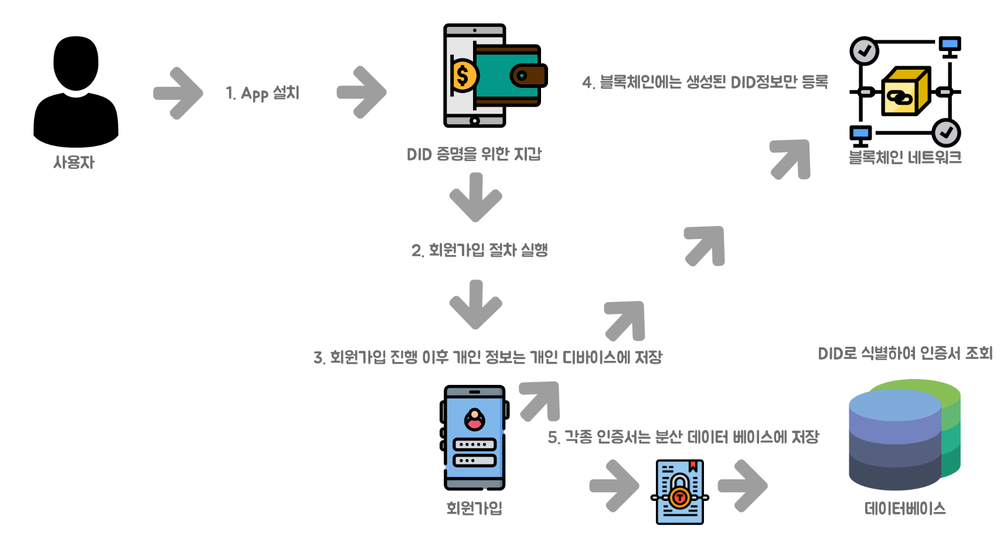
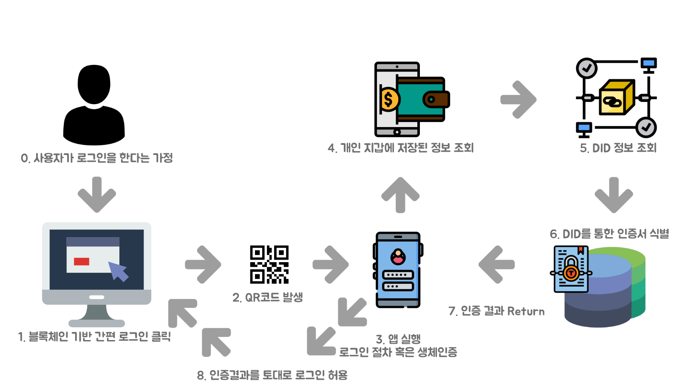
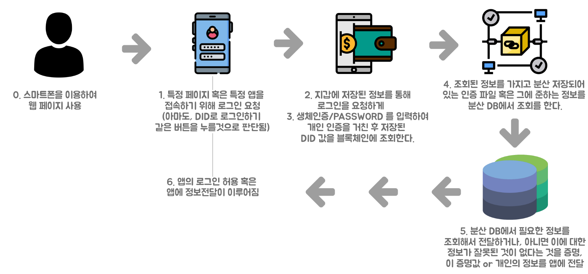

# Decentralized IDentifiers, DID를 알아보자.
ID : 자신을 증명하는 수단
- 증명 수단
    - 주민등록증, 운전면허증, 공인인증서 등..

DID : 온라인상에서 분산원장을 기반으로 사용자가 스스로 신원에 대한 증명 관리, 신원 정보 제출 범위 및 제출 대상 통제 등을 수행할 수 있도록 하는 신원관리 체계
- 신원 : 사용자의 이름, 나이, 개인 고유 식별 정보, 인증정보 등..
- 전통적인 서버-클라이언트 모델과 달리 사용자가 자신의 신원에 대한 주권이 행사 가능
- 분산원장은 P2P기반으로 운영되며, 올라간 데이터의 위조 변조가 어렵운 점을 기반으로 하여 신뢰된 ID 저장소를 통해 ID정보의 신뢰성 확보를 위해 분산원장 내 저장하는 형태를 이용한다.
- 위 내용을 기반으로 제 3기관의 통제 없이 분산원장에 참여 가능한 누구나 신원 정보의 위조 변조 여부를 검증할 수 있다.

## 그렇다면 검증 프로토콜이라 할 수 있을까?
OAuth는 인증프로토콜이 아닌 인가프로토콜, DID도 인증프로토콜이 아닌 검증 프로토콜? 인증과 검증은 차이가 있을까?
- 인증 (Certified)
    - 감독 기관이 공식적인 프로세스를 통해 회사의 업무 절차, 통제, 제품을 감사한 후 인증서를 제공한 것을 의미
    - ex) 주민등록증은 동사무소에서 신청 절차와 함께 국가에서 검증하여(어느 기관) 제공한다.
- 검증 (Validated)
    - 검사하여 증명함 이라는 뜻의 명사
    - ex) 정보가 맞는 정보인지 아닌지 신뢰할 수 있는 사람이 확인하여 진위여부를 알려주는 것

# 서버-클라이언트 모델 VS DID 모델
## 서버-클라이언트 모델
1. 사용자 서비스 가입 시 신원정보 등록, 서비스 이용 가입에 사용한 신원 정보를 서비스 제공자에게 제출
2. 서비스 제공자는 제출된 정보를 기반으로 신원 확인
## DID 모델
1. 신원정보발행자는 사용자의 신원을 검증 후 신원정보발행
2. 신원정보를 검증할 수 있는 발행자의 ID를 분산원장(블록체인)에 등록
3. 사용자는 서비스 이용 시, 신원정보를 서비스 제공자에게 제출
4. 서비스 제공자는 신뢰된 ID 저장소를 이용하여 신원 정보를 검증하여 신원확인

# 신원정보 관리 유형 변화 및 특징 (17.3.7 금융보안원 자료)
|유형|신원관리 주체|특징|서비스별ID갯수(서비스 수 : ID 수)|
|---:|---:|---:|---:|
|고립형|서비스 제공자|서비스별로 회원가입 필요|N:N|
|중앙 집중형|서비스 제공자|서비스 제공자가 다수 서비스 제공 시, 사용자가 한 곳에 가입을 하면 제공자의 타 서비스들을 이용 가능|N:1|
|연합형|사용자가 선택한 서비스 제공자|서비스 제공자들이 연합하여, 사용자가 연합된 곳 중 한 곳에서 회원가입하면, 타 연합 서비스들 이용 가능|N:1|
|이용자 중심형|사용자가 선택한 신원관리 서비스 제공자|사용자가 신원관리 서비스를 선택하여, 발행받은 신원정보로 여러 서비스 이용 가능, 신원정보는 신원관리 서비스 제공자가 관리|N:1|
|DID|사용자|사용자가 신원관리 서비스를 선택하여, 발행받은 신원정보로 여러 서비스 이용가능. 신원 정보는 분산원장 기반으로 공유, 신원정보는 사용자가 관리|N:K(사용자 필요시마다 신원 정보 발행 가능)|

# W3C에서 재정하고 있는 DRAFT 링크
https://w3c-ccg.github.io/did-spec/

# 이 프로젝트로 진행하고자 하는 목표
- 본인인증 서비스를 간소화 하자 (특히, 휴대폰 인증 부분)
    - 참고자료[1]의 링크를 보며 자료들을 또 추가로 찾아보며 정리한 내용들을 아래에 적을 예정
- 한국의 ID 인증/검증 시장, 공인인증서, 휴대폰 | 신용카드 본인 확인, 아이핀|마이핀, OTP 등으로 구성
    - DID로는 ID/PW의 분야, KYC 시장을 대체할 수 있을 것으로 보여짐

# DID 활용가능한 시장 조사
- 공인인증서 시장 ( 한국은행 자료 )
    - 한국은행 자료에 따르면 공인인증서는 2000년 26,845건에서 2016년 34,852,052건 발행.
    - 인증 건수 2015년 약 7800만건, 2018년 약 1억 1900만건
    - 2017년 공인인증서 시장 규모 655억 수준, 실제 인증건수 94,924,000건 -> 건당 비용 690원의 가치
- 휴대폰 본인 확인 시장 ( 17년 10월 김성수 의원 관공서 점검 자료 )
    - 스마트폰 등록 사용자
        - 15년 4360만명, 18년 4990만명
    - 스마트폰 인증 건수 및 비용
        - 13년 4.6억건, 16년 10억건 단위당 비용 26.7원
        - 15년 -> 16년 (20건 -> 22건) 약 10% 상승
- I-Pin (2016년 이재정 의원 관공서 점검자료,2017년 10월 19일 ZDNet 뉴스 기사 )
    - 공공아이핀 발급
        - 13년 400만건, 17년 4.8백만건 
    - 아이핀 사용시 불편, 해킹에서 안전하지 않음
        - 공공아이핀 18년 발급 중단
        - 단위비용 30원
- OTP ( KFTC (Korea Financial Telecommunications & Clearings Institute) 자료 )
    - 신규 : 14년 약 319만건, 17년 300만건
    - 누적 : 14년 약 1300만건, 17년 2137만건
        - 연간 유효 OTP 수 -> 신규 등록 및 신규 등록이 없는 누적 등록의 2/3
        - 14년 인증 건수 약9.6억, 18년 약 18.5억
    - 예상 단가 ( 신규 발급 + 누적발급 - 사용불가 갯수 = 유효 갯수 )
        - 발급 1개당 만원 산정 / 연간 총 이용 횟수 = 약 63원
- ID/PW 로그인 (KISA)
    - 2011년 KISA 자료 , ID/PW로그인 건 수 단위비용 = 공인인증서 사용 건 수의 2.96배
    - 15년 약 2억건, 19년 약 4억건
    - 대략적인 단가 : 10원
- KYC 인증 (Acuity)
    - Acuity에서 발간한 자료에서 한국 시장은 5% 정도 차지할 것으로 추정
    - 15년 2억건, 18년 3.6억건 정도
    - 단위비용 천원

## 결론 : 시장의 상승폭, 단위 비용 또한 증가
출처 : [DID자료](https://medium.com/@bennedict.jung/did-market-domestic-korean-market-size-1-645b137bb04a "DID자료")

# DID Process
## DID등록

## DID를 통한 웹 로그인

## DID를 통한 모바일 로그인

# 참고자료
[1] https://medium.com/@bennedict.jung/did-market-domestic-korean-market-size-1-645b137bb04a